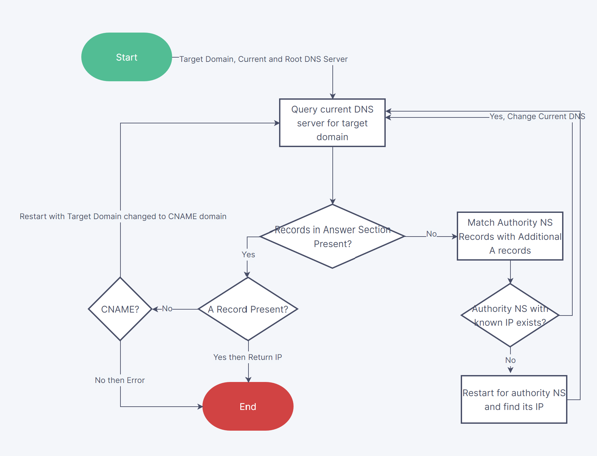

## A DNS Dive - Part 2

All of the code for this project is available at [archit120/DNSWhy](https://github.com/archit120/DNSWhy)

## The Code Structure 

 - `main.py` - logic for resolving domain name
 - `packing.py` - convert python structures to bytes for network
 - `unpacking.py` - convert bytes received from network back to python
 - `network.py` - simple UDP code to send and receive message
 - `structures.py` - defines a subset of structures in DNS
 - `enums.py` - contains subset of enums defined in DNS

I will cover each of these files one-by-one in reverse order.

### enums

This file contains the enum types defined in RFC1035. Not all have been implemented for sake of brevity, just the ones I needed to complete this. These were `Opcode`, `RCode`, `RType`, `QType`, `RClass` and `QClass`.

The `R*` enums are subsets of their `Q*` counter-parts. However, python doesn't support extending enums so I had to duplicate that information. Because not all possible enum values had been implemented I added an unknown code in all these enums. These are always coded to be an integer that's outside the maximum possible value for these enums.

Example of such a functionality - 

```python
class Opcode(Enum):
    QUERY = 1

    Unknown = 16
    @classmethod
    def _missing_(cls, value: object):
        return Opcode.Unknown
```


### structures

Similar to `enums.py`. Implements structures required for communication. A lot of effort could have been spared using `dataclasses` but I wanted to target python 3.6 so this wasn't an option for me. 

### network

Very barebones code to send and receive messages using UDP sockets. The functionality depends on `packing` and `unpacking` to convert messages to and from network formats.

### unpacking

`unpacking.py` is one of the more important files. It is responsible for creating `Message` python types from the datagram received. The code is a natural extension of whatever we discussed in Part - 1. Most of it is pretty uninteresting except for `read_string` that I want to talk about more.

```python
def read_string(data: bytes, start_pos: int) -> Tuple[str, int]:
    retstr = ''
    while True:
        length = data[start_pos]
        start_pos+=1
        if length == 0:
            return retstr[1:], start_pos
        elif length>63:
            length, = struct.unpack(">H", data[start_pos-1:start_pos+1])
            length -= 0xC000
            return (retstr+'.'+read_string(data, length)[0])[1:], start_pos+1
        retstr = retstr + '.' + data[start_pos:start_pos+length].decode('ascii')
        start_pos += length
``` 

`read_string` supports reading the domain names as implemented in RFC 1035 with compression. The basic idea is pretty simple, it takes as input the entire datagram and a `start_pos`. The function assumes that the `start_pos` is a valid byte number in the datagram and starts reading from there. Because labels are restricted to 63 characters, any length (which is the first byte) > 63 implies a pointer as described in compression. In which case we read a 2byte integer and remove the two higher order bits. Once that's done we can recursively call `read_string` for this new position. Caching could have been implemented here but wasn't because performance is not a concern. 

### packing

`packing.py` is simply the reverse of `unpacking`. The functionality implemented here is much less because I was only interested in `A` type queries for a single domain. There is one interesting thing to note that all integers and enum values in python are 32bit so I had to truncate that information when packing to short integer types. 

### main

The final dns logic is implemented in `main`. The code is pretty self explanatory but can also be visualized through this flowchart.



In the resolving part also caching could have been used to reduce the number of queries made but I didn't implement that. This logic might not be the most rigorous but it works well enough for all cases that I tried.

## Output

With all that out of the way finally lets look at the output for some websites. Let's start with the goal `www.citadel.com`

```
Asking 198.41.0.4 for www.citadel.com
No answer records found. Looking at authoritative records
Found 13 valid authoritative servers. Re-querying the first one with IP present
Name: a.gtld-servers.net, IP: 192.5.6.30
Asking 192.5.6.30 for www.citadel.com
No answer records found. Looking at authoritative records
Found 4 valid authoritative servers. Re-querying the first one with IP present
Name: ns-164.awsdns-20.com, IP: 205.251.192.164
Asking 205.251.192.164 for www.citadel.com
Found answers for target domain. Total 1 answers found
Found a CNAME record. Reasking root server for the new alias
Asking 198.41.0.4 for www.citadel.com.cdn.cloudflare.net
No answer records found. Looking at authoritative records
Found 13 valid authoritative servers. Re-querying the first one with IP present
Asking 192.5.6.30 for www.citadel.com.cdn.cloudflare.net
No answer records found. Looking at authoritative records
Found 5 valid authoritative servers. Re-querying the first one with IP present
Name: ns1.cloudflare.net, IP: 173.245.59.31
Asking 173.245.59.31 for www.citadel.com.cdn.cloudflare.net
Found answers for target domain. Total 2 answers found
Answer found!
104.18.24.189
104.18.25.189
```

Next, let's try this blog's domain.

```
Asking 198.41.0.4 for archit.me
No answer records found. Looking at authoritative records
Found 5 valid authoritative servers. Re-querying the first one with IP present
Name: a0.nic.me, IP: 199.253.59.1
Asking 199.253.59.1 for archit.me
No answer records found. Looking at authoritative records
Found 4 valid authoritative servers. Re-querying the first one with IP present
IP for none of the authoritative servers included in additional records. Querying for its IP first
Asking 198.41.0.4 for fortaleza.porkbun.com
No answer records found. Looking at authoritative records
Found 13 valid authoritative servers. Re-querying the first one with IP present
Name: a.gtld-servers.net, IP: 192.5.6.30
Asking 192.5.6.30 for fortaleza.porkbun.com
No answer records found. Looking at authoritative records
Found 4 valid authoritative servers. Re-querying the first one with IP present
Name: ns-199.awsdns-24.com, IP: 205.251.192.199
Asking 205.251.192.199 for fortaleza.porkbun.com
Found answers for target domain. Total 2 answers found
Answer found!
52.73.191.223
3.224.31.177
Asking 52.73.191.223 for archit.me
Found answers for target domain. Total 3 answers found
Answer found!
185.199.109.153
185.199.108.153
185.199.110.153
```

## Conclusion

It was pretty fun to read an RFC and implement everything from scratch. I had to use wireshark a couple of times to figure out the string compression but it turned out to be not too hard. Writing a blog post along with this was a nice way to make notes on the RFC and was definitely useful in bringing this project to completion. I _might_ make a part 3 where I create an interactive widget to run queries and power it using Heroku or AWS ServerLess. Hopefully more to come soon!